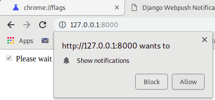
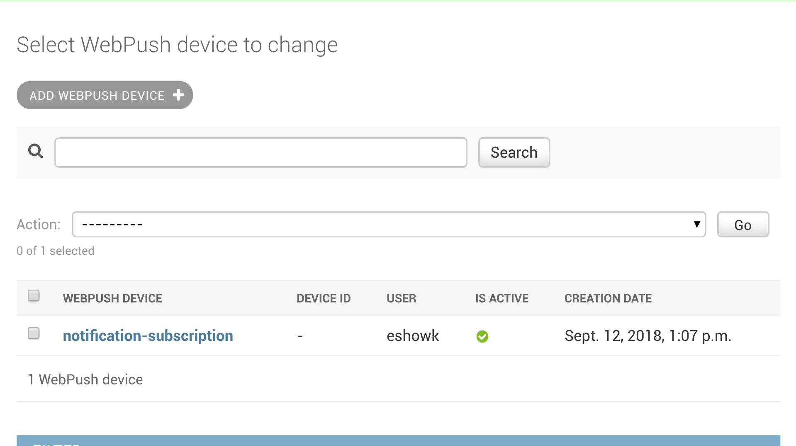
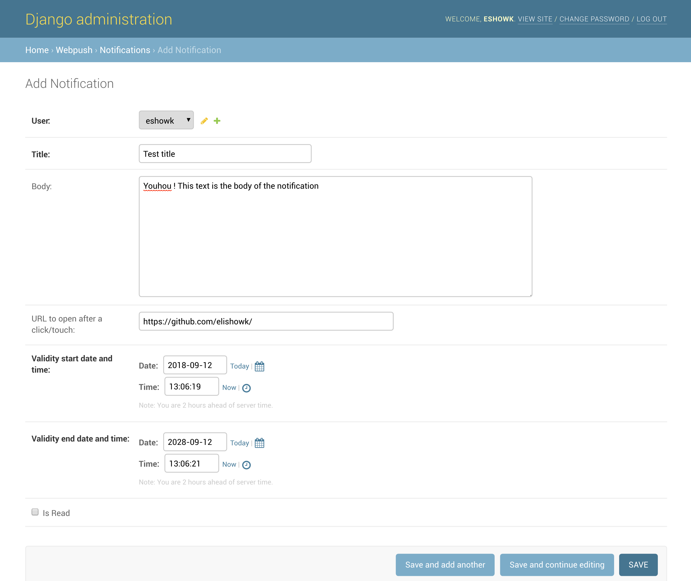
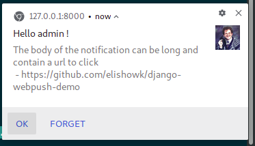

# django-webpush-demo

This is a django server using jazzband's django-push-notifications (https://github.com/jazzband/django-push-notifications), Django REST framework and Web-push-libs modules implementation of the Open Standard for Push API with VAPID (https://github.com/web-push-libs).

One nice features is the ability to store the user response when interactif with the call-to-actions of the Push notification; yep, did you know that a Push notification can display various CTAs ?

It's compatible with any browser supporting native push notifications with the Push API and Service workers (https://developer.mozilla.org/fr/docs/Web/API/Push_API)

## More important source-code is :

 * `webpush.js` and `service-worker.js`: the client-side code. Notifications are displayed with an default icon, two action buttons (OK, forget), and a click handler opening/focusing the browser on the URL carried by the notification data.
 * `webpush/urls.py`: the server's API
 * `webpush/management/commands/send_webpush.py`: server's cron-job to send the pending notifications

## How-to configure VAPID

 * After cloning this repository, please install the python environment

```bash
    cd django-webpush-demo
    virtualenv .venv --python=python3
    source .venv/bin/activate
    pip install -r requirements.txt
```

 * Create a temporary file (claim.json) to create your signing keys:

```javascript
   {
     "sub": "mailto: my@email.me",
     "aud": "https://fcm.googleapis.com"
   }
```

 * Generate client public key (applicationServerKey) and public and private keys

```bash
     vapid --applicationServerKey
```

[output]

```bash
       Application Server Key = BEFuGfKKEFp-kEB...JlkA34llWF0xHya70
```

## Install and run the Django server

### Configure Django settings:

  * Create your own local_settings.py next to settings.py, and add Application Server Key to  `PUSH_NOTIFICATIONS_SETTINGS['APP_SERVER_KEY']`
  * Modify the key WP_CLAIMS in settings.py : "sub" with the same email used in the file claim.json. Do not add the "aud" key, because the push servers could be Mozilla's or Google's, and django-push-notifications takes care of that.
  
### Launch it !
```
    python manage.py migrate
    python manage.py createsuperuser
    python manage.py runserver
```

## Push !

 * login with your admin account at http://localhost:8000/admin
 * check the subscribe box at http://localhost:8000, then check the user's subscription status at http://localhost:8000/admin/push_notifications/webpushdevice/
 * 
 * 
 * create the push notifications content at http://localhost:8000/admin/webpush/notification
 * 
 * then execute the command :

```bash
    python manage.py send_webpush
  
  Found a device id =  8 to push the notification id = 1
```

  * wait for the notification to show on your device !
 
 
  * check the status of the notification at http://localhost:8000/admin/webpush/notification/ (`is read`) and http://localhost:8000/admin/webpush/webpushrecord/ (`is sent`)
  
  * native notifications also can be tested on your mobile device, and it's really the point of the Web Push API.
  * server-side, to understand what's going on, you can go and read the code that sends the notification to the browser : https://github.com/jazzband/django-push-notifications/blob/master/push_notifications/webpush.py

## More...

 * The web Push API specification : https://developer.mozilla.org/fr/docs/Web/API/Push_API
 * A nice demonstration of the VAPID in the browser (brrr... this is unsafe) https://gauntface.github.io/simple-push-demo/
 * From google.com :https://developers.google.com/web/fundamentals/push-notifications/sending-messages-with-web-push-libraries


## TODO

  * UI obviously
  * Better documentation
  * Tests !
  * Replace the booleans `is read` and `is sent` (read previous section) Store a timestamp when sending the notification, store a timestamp when receiving the callback when the user clicks on an action button on the push notification (OK or Forget).
